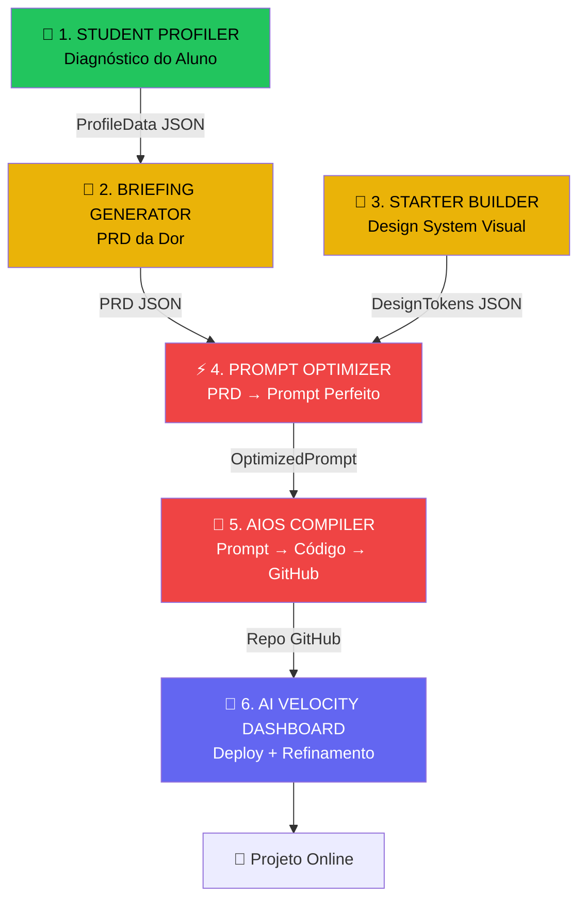
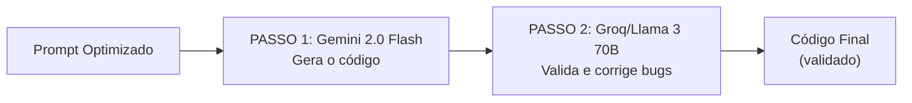

# 📋 PRD: ECOSSISTEMA IMERSÃO IA

> **Versão:** 1.0 | **Data:** 03/03/2026  
> **Autor:** Atlas (Analyst) + Eurico Alves (Mentor)  
> **Estado:** DRAFT — Aguarda aprovação

---

## 1. VISÃO E PROBLEMA

### 1.1 Problema
A maioria das pessoas quer criar soluções digitais com IA mas enfrenta 3 barreiras:
1. **Não sabe por onde começar** — tem uma "dor" mas não sabe transformá-la em requisitos técnicos
2. **Não domina ferramentas de código** — não tem acesso nem sabe usar Claude Code, terminais ou IDEs
3. **Falta de orientação estruturada** — os cursos tradicionais ensinam teoria sem entregar resultado prático

### 1.2 Visão
> *"Ideia no papel à solução pronta num fim de semana."*

Criar um **ecossistema web "Frictionless"** (sem atrito) onde qualquer pessoa, sem conhecimento técnico, consegue transformar a sua ideia num produto digital funcional, online e pronto — tudo via browser, sem terminal, com **custo zero**.

### 1.3 Proposta de Valor
- **Para o aluno:** Do zero ao produto em 2 dias, sem saber programar
- **Para o mentor:** Sistema replicável e escalável de Imersão a Imersão
- **Para a comunidade IA-PT:** Base de ferramentas que cresce e evolui com os membros

---

## 2. PÚBLICO-ALVO

### Persona Primária: "O Empreendedor Prático"
- 25-55 anos, Portugal
- Tem uma ideia/negócio mas não sabe programar
- Quer resultado concreto, não teoria
- Confortável com browser e redes sociais, desconfortável com terminal
- Orçamento limitado — não pode pagar ferramentas caras

### Persona Secundária: "O Curioso Tech" (2ª Imersão)
- Sabe usar computador a nível intermédio
- Quer aprender a usar IA como ferramenta profissional
- Aberto a usar terminal e ferramentas de desenvolvimento
- Pode investir em subscrições (Claude Code, etc.)

---

## 3. PIPELINE COMPLETO (6 FERRAMENTAS)



### Fluxo de Dados entre Ferramentas

| De → Para | Dados Transferidos | Formato |
|---|---|---|
| Profiler → Briefing | `ProfileData` (nível, intenção, visão, conhecimentos) | JSON via URL params ou Supabase |
| Briefing → Prompt Optimizer | `PRD` (nome, dor, features, público, nível, stack sugerida) | JSON |
| Starter Builder → Prompt Optimizer | `DesignTokens` (cores, fontes, estilo, layout) | JSON |
| Prompt Optimizer → AIOS Compiler | `OptimizedPrompt` (prompt completo estruturado) | String |
| AIOS Compiler → AI Velocity | `GitHubURL` (repo com o código gerado) | URL |

---

## 4. ESPECIFICAÇÃO POR FERRAMENTA

---

### 4.1 🧠 STUDENT PROFILER

**Estado:** ✅ Em produção  
**Pasta:** `imersao-tools/student-profiler`  
**URL:** Deployed (Vercel)

#### O que faz
Diagnóstico estratégico do aluno em 10 dimensões: consciência sobre IA, visão de mercado, conhecimento de ferramentas, nível de comprometimento, tipo de projeto, etc.

#### MVP (1ª Imersão) — Melhorias necessárias

| # | Feature | Prioridade |
|---|---|---|
| SP-1 | Exportar `ProfileData` como JSON para consumo pelo Briefing Generator | 🔴 Alta |
| SP-2 | Gerar URL com profile ID (Supabase) para partilha entre ferramentas | 🔴 Alta |
| SP-3 | Simplificar formulário para ~5 minutos de preenchimento | 🟡 Média |

#### Modelo de Dados (existente)
```typescript
interface ProfileData {
  awareness: string;       // Consciência sobre IA
  market_view: string;     // Visão de mercado
  vision: string;          // Visão pessoal
  tools_knowledge: string; // Conhecimento de ferramentas
  orchestration_view: string; // Compreensão de orquestração
  logic: string;           // Capacidade lógica
  intent: string;          // Intenção/objetivo
  project_type: string;    // Tipo de projeto
  friction: string;        // Pontos de atrito
  commitment: string;      // Nível de comprometimento
}
```

---

### 4.2 📝 BRIEFING GENERATOR

**Estado:** 🟡 Protótipo funcional  
**Pasta:** `imersao-tools/briefing-generator`

#### O que faz
O aluno descreve a sua "dor" num formulário multi-step e o motor `SmartAI.ts` gera um PRD profissional com stack técnica sugerida, requisitos funcionais e diretrizes de design.

#### MVP (1ª Imersão) — Melhorias necessárias

| # | Feature | Prioridade |
|---|---|---|
| BG-1 | Receber `ProfileData` do Profiler (pré-preencher `experienceLevel` e `intent`) | 🔴 Alta |
| BG-2 | Output em JSON estruturado (não só texto) para consumo pelo Prompt Optimizer | 🔴 Alta |
| BG-3 | Persistência do PRD em Supabase (guardar para consulta posterior) | 🟡 Média |
| BG-4 | Atualizar stack para React 19 + Vite 7 | 🟡 Média |
| BG-5 | Expandir padrões de detecção no `SmartAI.ts` (mais tipos de projeto) | 🟡 Média |
| BG-6 | Melhorar UX do formulário (progress bar, validação visual) | 🟡 Média |

#### Output do Motor SmartAI (actual)
O motor já gera 2 outputs:
- **Prompt para Claude Code** — Diretriz de execução com blueprint técnico
- **Payload para Gemini/AIOS** — Mission Start com scaffolding

#### Output Desejado (novo)
```typescript
interface BriefingOutput {
  projectName: string;
  painPoints: string;
  features: string[];
  targetAudience: string;
  experienceLevel: 'iniciante' | 'intermediário' | 'avançado';
  suggestedStack: {
    architecture: string;  // "Monolito Modular" | "PWA" | etc.
    frontend: string;      // "React 19 + Vite"
    backend: string;       // "Supabase" | "Node.js"
    database: string;      // "PostgreSQL + Supabase"
  };
  uiVibe: string;          // "Premium Dark Mode" | "Brutalismo" | etc.
  prdText: string;         // PRD formatado em Markdown
  timestamp: string;
}
```

---

### 4.3 🎨 STARTER BUILDER

**Estado:** 🟡 Planeamento (2 versões duplicadas)  
**Pasta:** `imersao-tools/starter-builder`

#### O que faz
Configurador visual onde o aluno escolhe o Design System, layout e features extras. Gera Design Tokens que alimentam o Prompt Optimizer.

#### MVP (1ª Imersão) — Melhorias necessárias

| # | Feature | Prioridade |
|---|---|---|
| SB-1 | Consolidar HTML standalone e projeto Vite numa só versão (React 19) | 🔴 Alta |
| SB-2 | Output: `DesignTokens` JSON (não apenas prompt texto) | 🔴 Alta |
| SB-3 | Integrar com Prompt Optimizer (enviar tokens via JSON) | 🔴 Alta |
| SB-4 | Manter os 5 Design Systems (Brutalista, Minimal, Glass, Neo-Gastro, Bento) | 🟡 Média |
| SB-5 | Adicionar preview visual de cada Design System | 🟢 Baixa |

#### Output Desejado
```typescript
interface DesignTokens {
  style: 'brutalist' | 'minimal' | 'glass' | 'gastro' | 'bento';
  layout: 'kanban' | 'list' | 'grid' | 'calendar';
  colorScheme: {
    background: string;    // "#000000"
    foreground: string;    // "#FFFFFF"
    accent: string;        // "#EEFF00"
  };
  typography: 'serif' | 'sans-serif' | 'mono';
  features: string[];      // ["priorities", "drag-drop", "search"]
  cssDirectives: string;   // Instruções CSS para a IA
}
```

---

### 4.4 ⚡ PROMPT OPTIMIZER (NOVA FERRAMENTA)

**Estado:** 🔴 A criar  
**Pasta proposta:** `imersao-tools/prompt-optimizer`

#### O que faz
Recebe o PRD do Briefing Generator e os Design Tokens do Starter Builder, aplica a SKILL correcta (template de instruções) e gera um **prompt ultra-otimizado** que qualquer IA interpreta sem ambiguidade.

#### Porque é necessária
O PRD é escrito para humanos lerem. A IA precisa de instruções numa estrutura diferente — com secções claras, regras explícitas, e zero ambiguidade. Esta ferramenta é o **tradutor** entre a linguagem humana e a linguagem da IA.

#### Features MVP (1ª Imersão)

| # | Feature | Prioridade |
|---|---|---|
| PO-1 | Receber `BriefingOutput` JSON do Briefing Generator | 🔴 Alta |
| PO-2 | Receber `DesignTokens` JSON do Starter Builder | 🔴 Alta |
| PO-3 | Seleccionar SKILL automaticamente (baseada no tipo de projeto) | 🔴 Alta |
| PO-4 | Gerar prompt estruturado com secções [ROLE][CONTEXT][ARCH][FILES][DESIGN][RULES] | 🔴 Alta |
| PO-5 | Preview do prompt final com syntax highlighting | 🟡 Média |
| PO-6 | Permitir edição manual do prompt antes de enviar | 🟡 Média |
| PO-7 | Botão "Enviar para o Compiler" | 🔴 Alta |

#### Sistema de SKILLs (Universal + Boosts)

> [!IMPORTANT]
> As SKILLs **NÃO são fixas por tipo de projecto**. Existe uma SKILL Universal que funciona para qualquer projecto. SKILLs de reforço são opcionais e melhoram o resultado quando o tipo de projecto é reconhecido.

```
skills/
├── skill-universal.md         → BASE: Funciona para QUALQUER projecto
│                                (construída dinamicamente pelo Prompt Optimizer)
│
└── boosts/ (opcionais, detectados automaticamente pelo SmartAI)
    ├── boost-restaurant.md    → Padrões PWA, menu digital, mobile-first
    ├── boost-ecommerce.md     → Lógica de carrinho, pagamento, stock
    ├── boost-dashboard.md     → Gráficos, tabelas, filtros de dados
    └── boost-portfolio.md     → Layout galeria, animações, SEO
```

**Como funciona:** O Prompt Optimizer constrói o prompt **sempre** a partir da SKILL Universal + dados do PRD. Se o SmartAI detectar keywords ("menu", "loja", "dashboard"), injeta o boost correspondente. Se não detectar nenhum → funciona na mesma.

SKILL Universal contém:
```markdown
# SKILL UNIVERSAL

## [ROLE]
You are a Senior Frontend Developer with 15+ years of experience...

## [ARCHITECTURE]  
- Modular structure: /features, /components, /api, /styles
- Persistence: LocalStorage (MVP) or Supabase

## [FILE_STRUCTURE]
src/
├── App.tsx        → Root component with navigation
├── features/      → One folder per feature domain
├── components/ui/ → Reusable Buttons, Cards, Inputs
├── styles/        → theme.css with design tokens
└── main.tsx       → Entry point

## [DESIGN_INJECTION]
{{DESIGN_TOKENS}}  ← Replaced by Starter Builder tokens

## [RULES]
- All code in English (variables, functions, comments)
- UI strings (labels, buttons, text) in Portuguese (PT-PT)
- No placeholder / Lorem Ipsum
- Each file ≤ 200 lines
- Mobile-first responsive
```

#### Estrutura do Prompt Gerado
```
[ROLE] Senior Developer + Designer specialized in {{style}}
[CONTEXT] Project "{{projectName}}" to solve: "{{painPoints}}"
[TARGET] {{targetAudience}}
[ARCHITECTURE] {{suggestedStack}} with modular structure
[LANGUAGE]
  - All code (variables, functions, comments): ENGLISH
  - UI strings (labels, buttons, user-facing text): Portuguese (PT-PT)
[FEATURES]
  - FR-1: {{feature1}} with elite UX
  - FR-2: {{feature2}} with visual feedback
  ...
[DESIGN]
  - Style: {{style}} ({{cssDirectives}})
  - Colors: bg={{background}}, fg={{foreground}}, accent={{accent}}
  - Typography: {{typography}}
[FILES] Generate the following files:
  - src/App.tsx
  - src/styles/theme.css
  - src/features/{{feature1}}/index.tsx
  ...
[RULES]
  - No external dependencies beyond React + Lucide
  - Complete, functional, production-ready code
  - Mobile-first responsive
  - Max 200 lines per file
[OUTPUT] Complete code for each file, separated by code blocks
```

---

### 4.5 🔧 AIOS COMPILER (NOVA FERRAMENTA)

**Estado:** 🔴 A criar  
**Pasta proposta:** `imersao-tools/aios-compiler`

#### O que faz
Recebe o prompt otimizado, chama a **API Gemini 2.0 Flash (grátis)**, gera o código completo, e faz **push automático para o GitHub** do aluno.

#### Features MVP (1ª Imersão)

| # | Feature | Prioridade |
|---|---|---|
| AC-1 | Receber `OptimizedPrompt` do Prompt Optimizer | 🔴 Alta |
| AC-2 | Chamar API Gemini 2.0 Flash para gerar código | 🔴 Alta |
| AC-3 | Mostrar código gerado com syntax highlighting | 🔴 Alta |
| AC-4 | Efeito visual de geração em tempo real (streaming) | 🟡 Média |
| AC-5 | Parse do output em ficheiros separados (App.tsx, theme.css, etc.) | 🔴 Alta |
| AC-6 | Autenticação GitHub OAuth (login com conta do aluno) | 🔴 Alta |
| AC-7 | Criar repo + push automático para o GitHub do aluno | 🔴 Alta |
| AC-8 | Botão "Abrir no AI Velocity Dashboard" (redirect com URL do repo) | 🔴 Alta |
| AC-9 | Botão "Regenerar" se o resultado não agradar | 🟡 Média |
| AC-10 | Rate limit visual (mostrar quantas gerações restam) | 🟡 Média |

#### Arquitectura Técnica
```
Browser (React App)
    │
    ├── Frontend: React 19 + Vite 7
    │
    ├── API Calls:
    │   ├── Gemini API (grátis) → Geração de código
    │   └── GitHub API (OAuth) → Criar repo + push ficheiros
    │
    └── Sem backend próprio (tudo client-side ou serverless)
```

#### Limites e Custos

| Serviço | Limite Gratuito | Para 20 alunos × 5 gerações |
|---|---|---|
| Gemini 2.0 Flash | 15 RPM, 1M tokens/dia | ✅ Suficiente (100 chamadas) |
| GitHub API | 5.000 req/hora (autenticado) | ✅ Suficiente |
| **Custo total** | | **$0.00** |

> [!IMPORTANT]
> A API Gemini é chamada **diretamente do browser do aluno** (client-side) usando a key pessoal do aluno (conta Google gratuita) OU usando uma key partilhada do mentor com rate limit. Alternativa: usar Vercel serverless function como proxy para proteger a key.

---

### 4.6 🚀 AI VELOCITY DASHBOARD

**Estado:** 🟡 MVP deployed  
**Pasta:** `ai-velocity-project`  
**URL:** [ai-velocity-project.vercel.app](https://ai-velocity-project.vercel.app/)

#### O que faz
Hub final do pipeline. O aluno cola o URL do GitHub (gerado pelo AIOS Compiler) e o Dashboard trata do deploy na Vercel, com possibilidade de refinamento via as estações de missão.

#### Ajustes para 1ª Imersão

| # | Feature | Prioridade |
|---|---|---|
| AV-1 | MissionDashboard: aceitar URL do GitHub (do AIOS Compiler) via URL params | 🔴 Alta |
| AV-2 | Fluxo simplificado: GitHub URL → Deploy Vercel (skip estações intermédias) | 🔴 Alta |
| AV-3 | Remover dependência do `materializer.cjs` backend local | 🔴 Alta |
| AV-4 | Manter estações (Architect, UX, etc.) como opcionais/futuras | 🟡 Média |
| AV-5 | Estado final: mostrar URL do site do aluno em produção | 🔴 Alta |

#### Fluxo Simplificado (1ª Imersão)
```
Aluno chega com URL do GitHub (do AIOS Compiler)
    │
    ▼
MissionDashboard: Cola o URL → Botão "DEPLOY AGORA"
    │
    ▼
DevOpsStation: vercel --prod → URL de produção
    │
    ▼
🎉 "O TEU SITE ESTÁ ONLINE!" + botão para ver
```

---

## 5. STACK TÉCNICA UNIFICADA

| Componente | Tecnologia | Justificação |
|---|---|---|
| **Framework** | React 19 | Última versão, consistência em todas as tools |
| **Build** | Vite 7 | Rápido, leve, HMR consistente |
| **Linguagem** | TypeScript | Tipagem forte, menos bugs |
| **Estilo** | CSS puro (com variáveis CSS) | Sem dependências, "Frictionless" |
| **Ícones** | Lucide React | Leve, consistente, já usado |
| **Backend** | Supabase (BaaS) | Auth, DB, Storage — tudo grátis |
| **IA** | API Gemini 2.0 Flash | Grátis, potente, streaming |
| **Git** | GitHub API (OAuth) | Push automático, familiar |
| **Deploy** | Vercel (Free Tier) | Deploy automático, SSL, CDN |

#### Portas de Desenvolvimento Local

| Ferramenta | Porta |
|---|---|
| Student Profiler | 5191 |
| Briefing Generator | 5190 |
| Starter Builder | 5192 |
| Prompt Optimizer | 5193 |
| AIOS Compiler | 5194 |
| AI Velocity Dashboard | 5195 |

---

## 6. SISTEMA DE CONTAS DO ALUNO (Setup Inicial)

Cada aluno cria as suas contas gratuitas **antes** da Imersão:

| Serviço | O que precisa | Free Tier |
|---|---|---|
| **Google** | Conta Google (para API Gemini) | Ilimitado |
| **GitHub** | Conta pessoal | Repos ilimitados |
| **Vercel** | Login com GitHub | 100 deploys/mês |
| **Supabase** | Conta gratuita (opcional) | 500MB, 50K rows |

> **Guia de Setup:** Criar um documento passo-a-passo com screenshots para o aluno configurar tudo em 15 minutos antes da Imersão.

---

## 7. CRONOGRAMA DA 1ª IMERSÃO (FIM DE SEMANA)

### SÁBADO: DO CONCEITO À PRÁTICA

| Hora | Actividade | Ferramentas Usadas |
|---|---|---|
| 10:00-11:00 | **Realidade Real:** Palestra sobre IA + Setup de contas | Nenhuma (apresentação) |
| 11:00-13:00 | **Treino:** Todos constroem um Task Manager | Pipeline completo (1→6) |
| 13:00-15:00 | Almoço | — |
| 15:00-19:00 | **Mão na Massa:** Projeto individual (dor real do aluno) | Pipeline completo (1→6) |
| 22:00-23:30 | **Ponto Socorro:** Suporte via Google Meet + WhatsApp | Debugging individual |

### DOMINGO: REFINAMENTO E ENTREGA

| Hora | Actividade | Ferramentas Usadas |
|---|---|---|
| 10:00-13:00 | **Refinamento:** Ajustar design e funcionalidades | Starter Builder + re-compilar |
| 13:00-15:00 | Almoço | — |
| 15:00-16:00 | **Fecho:** Deploy final + personalização | AI Velocity Dashboard |
| 22:00 | **Ponto Socorro Final:** Validação e celebração | Verificação dos sites online |

---

## 8. USER STORIES (MVP)

### US-1: Diagnóstico Rápido
> Como aluno, quero preencher um questionário de 5 min para que o sistema entenda o meu nível e objectivos.

**Critérios:** ≤10 perguntas, resultado `ProfileData` guardado em Supabase, URL partilhável.

### US-2: Da Dor ao PRD
> Como aluno, quero descrever a minha "dor" em linguagem simples e receber um PRD técnico profissional.

**Critérios:** Formulário multi-step, detecção inteligente do tipo de projeto, output JSON + Markdown.

### US-3: Escolher o Visual
> Como aluno, quero escolher o estilo visual da minha app sem saber CSS.

**Critérios:** 5+ Design Systems com preview, output `DesignTokens` JSON.

### US-4: Prompt Perfeito
> Como aluno, quero ver o prompt optimizado antes de gerar o código, para poder ajustar se necessário.

**Critérios:** Preview do prompt com syntax highlighting, botão de edição, botão "Enviar".

### US-5: Código Gerado Automaticamente
> Como aluno, quero que o sistema gere o código completo e faça push para o meu GitHub sem eu tocar no terminal.

**Critérios:** Login GitHub OAuth, repo criado automaticamente, ficheiros commitados, feedback visual.

### US-6: Deploy em Um Clique
> Como aluno, quero fazer deploy do meu projecto num clique e ter um URL público.

**Critérios:** Botão "Deploy", URL de produção visível, estado "PRODUCTION READY".

---

## 9. RISCOS E MITIGAÇÕES

| Risco | Probabilidade | Mitigação |
|---|---|---|
| API Gemini atingir rate limit | Média | **Fallback:** API Groq (Llama 3 70B, grátis, 14.400 req/dia) |
| Aluno não consegue criar contas | Baixa | Guia passo-a-passo + sessão setup pré-Imersão |
| GitHub OAuth complexo de implementar | Média | Alternativa: download ZIP + upload manual ao GitHub |
| **Código gerado pela IA com bugs** | **Alta** | **Estratégia Dual-Pass** (ver abaixo) |
| PCs dos alunos com problemas | Média | Tudo browser-based, funciona em qualquer dispositivo |

### 9.1 Estratégia Dual-Pass Anti-Bug

O maior risco é o código gerado ter bugs. Para minimizar:



| Passo | API | Função | Custo |
|---|---|---|---|
| 1. Geração | Gemini 2.0 Flash | Gera código a partir do prompt | Grátis |
| 2. Validação | Groq (Llama 3 70B) | Revê o código, corrige erros, valida lógica | Grátis |

**Medidas adicionais:**
- Prompts em inglês = IA gera código mais limpo
- Projectos limitados a 1-3 ficheiros no MVP (menos superfície de erro)
- SKILL Universal inclui esqueleto já testado que a IA preenche
- Ponto Socorro (22h) para resolver bugs ao vivo com o mentor

---

## 10. ROADMAP

### Fase 1: MVP para 1ª Imersão 🔴
- [ ] Melhorar Student Profiler (SP-1, SP-2)
- [ ] Melhorar Briefing Generator (BG-1, BG-2)
- [ ] Consolidar Starter Builder (SB-1, SB-2, SB-3)
- [ ] Criar Prompt Optimizer (PO-1 a PO-7)
- [ ] Criar AIOS Compiler (AC-1 a AC-8)
- [ ] Ajustar AI Velocity Dashboard (AV-1 a AV-3, AV-5)
- [ ] Criar SKILLs base (skill-react-app, skill-landing-page, skill-dashboard)
- [ ] Criar Guia de Setup do Aluno
- [ ] Teste end-to-end do pipeline completo

### Fase 2: Pós 1ª Imersão 🟡
- [ ] Persistência cross-tool em Supabase
- [ ] Design System unificado entre todas as ferramentas
- [ ] Mais SKILLs (skill-pwa-restaurant, skill-ecommerce, skill-portfolio)
- [ ] Comunidade IA-PT: página de membros e projectos
- [ ] Dashboard do Mentor: ver progresso de todos os alunos

### Fase 3: 2ª Imersão (Avançada) 🟢
- [ ] Integração com Gemini CLI (terminal)
- [ ] Alunos aprendem a criar as suas próprias SKILLs
- [ ] AI Velocity Dashboard com estações reais (não mocks)
- [ ] Integração com Claude Code para alunos avançados

---

## 11. MÉTRICAS DE SUCESSO (1ª Imersão)

| Métrica | Objectivo |
|---|---|
| Alunos com projecto online no domingo | **100%** |
| Tempo médio do pipeline (Profiler → Deploy) | **< 45 min** (treino) |
| Custo total de APIs | **$0.00** |
| NPS (satisfação do aluno) | **≥ 8/10** |
| Alunos que querem 2ª Imersão | **≥ 70%** |

---

---

## 12. REGISTO DE BUGS CRÍTICOS — CAUSA RAIZ CONFIRMADA

> **Secção criada em:** 15/03/2026
> **Registado por:** Quinn (QA Agent) durante sessão de testes E2E
> **Autoridade:** Este registo é PERMANENTE e deve ser consultado antes de qualquer trabalho no AIOS Compiler ou Prompt Optimizer.

---

### BUG-001 — Conflito Arquitectural: Prompt Optimizer vs GeminiService

**Estado:** 🔴 CRÍTICO — NÃO RESOLVIDO
**Detectado em:** 15/03/2026 após 18 dias de loop
**Ficheiro:** `imersao-build/packages/aios-compiler/src/features/code-generator/GeminiService.ts`

#### Descrição do Problema

Durante 18 dias consecutivos, o pipeline chegava à fase de geração de código com erros de sintaxe no App.tsx. A resposta habitual era corrigir o código **gerado** (o projecto de teste) e avançar. O AIOS Compiler ficava sempre com o mesmo bug. O ciclo repetia-se.

**O problema real nunca foi o código gerado. Foi um conflito arquitectural entre duas ferramentas que nunca foram alinhadas.**

#### Causa Raiz — Diagrama do Conflito

```
Prompt Optimizer (porta 5193)          GeminiService.ts (AIOS Compiler)
─────────────────────────────          ────────────────────────────────
Gera prompt com [FILES]:               SYSTEM_INSTRUCTION diz:
  - src/App.tsx                          RULE 1: ONE FILE ONLY
  - src/styles/theme.css                 RULE 2: NO LOCAL IMPORTS
  - src/features/feature-1/index.tsx     "Only import from 'react' or
  - src/features/feature-2/index.tsx      'lucide-react'. Never from
  - src/features/feature-3/index.tsx      './anything'."
  - src/components/ui/Button.tsx
  - src/types/index.ts

         ↓                                        ↓
   "Gera 9 ficheiros                      "Gera 1 ficheiro,
    com imports entre eles"                sem imports locais"

                    ↓ LLM recebe AMBOS ↓

               RESULTADO: App.tsx com
               import Feature1 from './features/feature-1'
               que viola a sua própria regra → SINTAXE PARTIDA
```

#### Evidência — App.tsx Gerado (15/03/2026)

```tsx
// ERROS PRODUZIDOS PELO CONFLITO:
import Feature3 './features/feature-3';    // falta "from" — LLM confuso
const App () => {                           // falta "=" — LLM confuso
const [projects, set] = useState([]);      // nome errado
const fetchInvoices = async () =>          // falta "{"
fetch('/api/invoices')                     // API backend inexistente
<h1>App de Gestão de Free                  // JSX truncado
```

#### O Que ERA Feito (Errado)

1. Código gerado tem erros → corrigir o código gerado manualmente
2. Fazer push do projecto de teste corrigido
3. Pipeline "passa" para esse teste específico
4. Na próxima sessão: Prompt Optimizer gera o mesmo prompt multi-ficheiro
5. GeminiService aplica o mesmo system prompt single-file
6. Mesmo conflito → mesmo erro → repetir desde o passo 1
7. **18 dias no mesmo ciclo**

#### O Que Deve SER Feito (Fix Real)

**Opção A — Fix no GeminiService.ts (RECOMENDADO):**

Remover RULE 1 e RULE 2 do `SYSTEM_INSTRUCTION` (linha 11-12).
O prompt do Optimizer já define a arquitectura — o system prompt não deve contradizê-la.

```typescript
// REMOVER do SYSTEM_INSTRUCTION:
// RULE 1 — ONE FILE ONLY: Generate exactly one file: src/App.tsx.
// RULE 2 — NO LOCAL IMPORTS: Only import from 'react' or 'lucide-react'.

// MANTER:
// RULE 3 — IMPLEMENT EVERYTHING
// RULE 4 — PORTUGUESE UI
// RULE 5 — APPLY THE DESIGN
// RULE 6 — REAL DATA
// RULE 7 — LOCALSTORAGE
```

Fazer o mesmo no `GROQ_MARKER_SYSTEM` (linha 28): remover "All types, state, components, and styles in ONE file" e "Only import from 'react' or 'lucide-react'".

**Opção B — Fix no Prompt Optimizer:**

Mudar a secção [FILES] para gerar sempre apenas `src/App.tsx` (single-file), alinhando com o que o GeminiService espera. Mais simples mas limita a arquitectura dos projectos gerados.

#### Impacto Previsto do Fix

| Antes do Fix | Depois do Fix |
|---|---|
| LLM recebe instruções contraditórias | LLM recebe uma única arquitectura clara |
| App.tsx com imports locais inválidos | App.tsx sem imports locais (single-file) |
| Syntax errors em 80%+ das gerações | Syntax errors eliminados estruturalmente |
| QA/mentor corrige manualmente | Pipeline funciona de forma autónoma |

#### Comando AIOX para Implementar

```
@dev

Fix GeminiService.ts:
- Remover RULE 1 (ONE FILE ONLY) do SYSTEM_INSTRUCTION
- Remover RULE 2 (NO LOCAL IMPORTS) do SYSTEM_INSTRUCTION
- Remover "ONE file" do GROQ_MARKER_SYSTEM
- Remover "Only import from 'react' or 'lucide-react'" do GROQ_MARKER_SYSTEM
Ficheiro: imersao-build/packages/aios-compiler/src/features/code-generator/GeminiService.ts
```

#### Nota do Mentor (Eurico Alves — 15/03/2026)

> "Andámos 18 dias a corrigir o mesmo erro. Sempre que chegávamos à fase de detecção do erro, corrigíamos o projecto de teste. O verdadeiro erro — o conflito entre o Optimizer e o Compiler — nunca foi tocado. Este registo existe para garantir que esta situação não se repita. Quem trabalhar neste pipeline deve ler esta secção primeiro."

---

### BUG-002 — HANDOFF com Nomes de Tabelas Incorrectos

**Estado:** 🟡 MENOR — Documentação desactualizada
**Detectado em:** 15/03/2026
**Ficheiro afectado:** `HANDOFF_E2E_15032026.md`

| Campo | HANDOFF diz | Código real diz |
|---|---|---|
| Tabela Supabase | `briefing_outputs` | `briefings` (`supabaseClient.ts:21`) |
| URL partilhável | `?projectId=<ID>` | `?load-briefing=<ID>` (`App.tsx:87`) |
| Parâmetro Optimizer | `?tokens=<encoded>` | `?briefing=<encoded>` (`App.tsx:351`) |

**Fix:** Actualizar HANDOFF e documentação do pipeline com os nomes correctos.

---

*Secção adicionada por Quinn (QA Agent) — Imersão IA Portugal*
*Revisão obrigatória antes de qualquer trabalho no AIOS Compiler ou Prompt Optimizer*

---

*PRD criado sob orientação de Eurico Alves — Mentor da Imersão IA Portugal*
*Gerado por Atlas (Analyst) do ecossistema AIOS*
